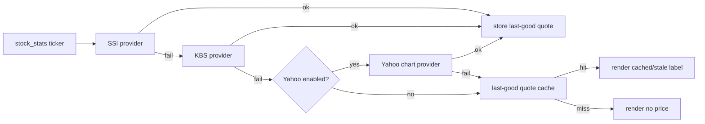

# Research Report: VN Stock Price Provider

## Executive Summary

Need better provider for `/stock_stats`. Current KBS endpoint works locally but failed in Lambda symptoms: every holding `(no price)`, total value only cash. Increasing timeout alone is not enough. Single provider + no last-good cache is the real fragility.

Best practical path: add a provider chain with **SSI iBoard chart history as primary**, existing **KBS as fallback**, and **DynamoDB last-good price cache** as final fallback. Keep Yahoo Finance chart endpoint as **opt-in emergency fallback only**, because Yahoo terms are hostile to automated collection.

No fully official, documented, free VN stock quote API found. All usable no-key endpoints are broker/app internals. Therefore design must assume endpoint breakage: provider interface, short deadlines, source labels, health logs, cache.

## Research Methodology

- Conducted: 2026-06-25.
- Repo context: Go bot on AWS Lambda 256 MB, 10s webhook handler, DynamoDB KV.
- Gemini: enabled in config, but CLI auth/trust failed. Used WebSearch + direct endpoint probes.
- Sources/probes consulted:
  - SSI iBoard app: https://iboard.ssi.com.vn/
  - SSI chart endpoint: `https://iboard-api.ssi.com.vn/statistics/charts/history?symbol=TCB&resolution=D&from=1781136000&to=1782345600`
  - KBSV site / KB Buddy WTS: https://www.kbsec.com.vn/
  - KBS current endpoint: `https://kbbuddywts.kbsec.com.vn/iis-server/investment/stocks/TCB/data_day?sdate=11-06-2026&edate=25-06-2026`
  - Yahoo chart endpoint: `https://query1.finance.yahoo.com/v8/finance/chart/TCB.VN?range=5d&interval=1d`
  - Yahoo Terms: https://legal.yahoo.com/us/en/yahoo/terms/otos/index.html
  - VNDIRECT probe: `https://finfo-api.vndirect.com.vn/v4/stock_prices?q=code:TCB&sort=date:desc&size=1`
  - FireAnt probe: `https://restv2.fireant.vn/symbols/TCB/quote`
  - TCBS guessed probes under `https://apipubaws.tcbs.com.vn/stock-insight/...`

## Scope

Need daily/current-ish close price for VN listed tickers used by paper portfolio stats. Must be cheap/free, no private auth if possible, JSON, simple Go client, safe under Lambda webhook budget. Out of scope: licensed professional market-data feed, realtime trading-grade data, websocket streaming, paid vendor contract.

## Key Findings

### 1. Current KBS Provider

Current code uses KBS:

```text
https://kbbuddywts.kbsec.com.vn/iis-server/investment/stocks/{TICKER}/data_day?sdate=DD-MM-YYYY&edate=DD-MM-YYYY
```

Probe result for held tickers on 2026-06-25:

| Symbol | Status | Time ms | Price VND |
|---|---:|---:|---:|
| MWG | 200 | 245 | 77,200 |
| SSI | 200 | 201 | 26,500 |
| TCB | 200 | 220 | 33,400 |
| VND | 200 | 179 | 17,350 |
| FPT | 200 | 254 | 71,000 |
| HPG | 200 | 203 | 23,400 |
| MSN | 200 | 164 | 71,500 |

Good: returns VND unscaled, already integrated, matches expected holdings.

Bad: no formal public API contract found, current Lambda symptom suggests endpoint/domain path can be unreliable from AWS. Keep as fallback, not sole source.

### 2. SSI iBoard Chart History

Endpoint tested:

```text
https://iboard-api.ssi.com.vn/statistics/charts/history?symbol={TICKER}&resolution=D&from={unix_seconds}&to={unix_seconds}
```

Response shape:

```json
{
  "code": "SUCCESS",
  "message": "Get chart history data success",
  "data": {
    "t": [1781136000],
    "c": [33.4],
    "o": [],
    "h": [],
    "l": [],
    "v": []
  },
  "status": "ok"
}
```

Important: close values are in thousands of VND. Multiply by `1000`.

Probe result for held tickers:

| Symbol | Status | Time ms | Rows | Price VND |
|---|---:|---:|---:|---:|
| MWG | 200 | 329 | 11 | 77,200 |
| SSI | 200 | 336 | 11 | 26,500 |
| TCB | 200 | 355 | 11 | 33,400 |
| VND | 200 | 308 | 11 | 17,350 |
| FPT | 200 | 353 | 11 | 71,000 |
| HPG | 200 | 306 | 11 | 23,400 |
| MSN | 200 | 277 | 11 | 71,500 |

Good: same values as KBS, simple JSON, no key, stable chart-history shape, official SSI app domain.

Bad: no formal API docs found. Batch query with comma-separated symbols returned empty arrays, so one request per symbol.

Verdict: **best default primary provider** for this bot.

### 3. Yahoo Finance Chart

Endpoint tested:

```text
https://query1.finance.yahoo.com/v8/finance/chart/{TICKER}.VN?range=5d&interval=1d
```

Probe result:

| Symbol | Status | Time ms | Rows | Price VND |
|---|---:|---:|---:|---:|
| MWG.VN | 200 | 145 | 5 | 77,200 |
| SSI.VN | 200 | 111 | 5 | 26,500 |
| TCB.VN | 200 | 97 | 5 | 33,400 |
| VND.VN | 200 | 120 | 5 | 17,350 |
| FPT.VN | 200 | 114 | 5 | 71,000 |
| HPG.VN | 200 | 262 | 5 | 23,400 |
| MSN.VN | 200 | 252 | 5 | 71,500 |

Good: fastest in local probe, returns direct VND, broad exchange metadata.

Bad: batch quote endpoint returned 401. Yahoo terms restrict automated collection and reuse without permission, and services are provided as-is with no support/reliability warranty. Do not make this default unless user accepts terms risk.

Verdict: **opt-in fallback only**, disabled by default.

### 4. VNDIRECT / TCBS / FireAnt

VNDIRECT `finfo-api.vndirect.com.vn` refused connection from local probe. TCBS guessed `stock-insight` endpoints returned 404. FireAnt guessed quote endpoint returned 404. Existing FireAnt usage in repo is for income events, auth-aware, not a known quote API.

Verdict: not useful until exact maintained endpoints/docs are found.

## Comparative Analysis

| Provider | Works for 7 holdings | Auth | Unit | Batch | Contract risk | Recommendation |
|---|---:|---|---|---|---|---|
| SSI iBoard history | yes | none | thousand VND | no | medium | primary |
| KBS data_day | yes | none | VND | no | medium | fallback |
| Yahoo chart | yes | none for chart | VND | no | high | opt-in fallback |
| VNDIRECT finfo | no in probe | unknown | unknown | unknown | high | skip |
| TCBS apipubaws | no in probe | unknown | unknown | unknown | high | skip |
| FireAnt quote | no in probe | maybe auth | unknown | unknown | high | skip |

## Recommended Architecture



### Provider Order

1. `SSIProvider` primary.
2. `KBSProvider` fallback.
3. `YahooProvider` fallback only if env flag enables it, e.g. `STOCK_YAHOO_PRICE_FALLBACK=1`.
4. KV last-good quote cache.

### Why This Order

- SSI and KBS are both broker app endpoints. SSI is a separate domain/path from the current failing KBS path.
- Yahoo is technically good but policy-risky. Keep it explicit, not hidden.
- Cache is mandatory. It solves the actual user-facing disaster: all prices zero during transient provider failure.

## Implementation Recommendations

### Quick Start

1. Replace concrete `PriceClient.FetchPrice` internals with provider chain.
2. Add `StockPrice` struct:

```go
type StockPrice struct {
    Symbol    string
    VND       float64
    Source    string
    UpdatedAt int64
    Stale     bool
}
```

3. Add provider interface:

```go
type PriceProvider interface {
    FetchPrice(ctx context.Context, ticker string) (StockPrice, error)
}
```

4. Implement `SSIProvider`.
5. Convert current KBS logic into `KBSProvider`.
6. Add optional `YahooProvider`, gated by env.
7. Add KV cache:

```text
price:{TICKER} -> {symbol, vnd, source, updatedAt}
```

8. `/stock_buy` and `/stock_sell`: require fresh provider quote; do not use stale cache for trades.
9. `/stock_stats`: live provider first, stale cache allowed, label stale.

### SSI Parsing Rules

```go
// data.c is chronological and quoted in thousand VND.
latest := resp.Data.C[len(resp.Data.C)-1] * 1000
```

Validation:

- `code == "SUCCESS"` or `status == "ok"`.
- `len(data.c) > 0`.
- latest price finite and positive.
- ticker regex already exists; keep it.
- endpoint HTTPS only unless localhost test server.

### Timeout

Do not simply return to 10s per fetch.

Recommended:

- per provider call: `2s` to `3s`
- whole stats fetch context: current `chathelper.FetchContext`
- sequential fetch remains fine for small portfolios
- if later optimizing: bounded worker pool with provider cache, not unlimited fanout

### Display

Fresh:

```text
TCB x4200 @ 33.400 VND = 140.280.000 VND (SSI)
```

Cached:

```text
TCB x4200 @ 33.400 VND = 140.280.000 VND (cached SSI, 25/06 15:10)
```

No cache:

```text
TCB x4200 (no price)
```

## Security Considerations

- Keep ticker regex `^[A-Z0-9]{1,16}$`.
- No arbitrary provider URL from user input.
- If env overrides are added, require HTTPS except localhost tests.
- Do not log response bodies; log provider, ticker, status, duration, error class.
- Yahoo: terms restrict automated collection. Keep disabled by default.
- Cache poisoning risk low if only providers write cache, but validate positive finite prices and reasonable upper bound.

## Performance Insights

For current 7 holdings, local 2026-06-25 probes:

- SSI: 277-355ms per symbol.
- KBS: 164-254ms per symbol.
- Yahoo chart: 97-262ms per symbol.

All are acceptable for a personal bot if sequential and if reply reserve remains. Cache makes worst-case provider outage cheap.

## Common Pitfalls

- Treating SSI close as direct VND. It is thousand VND.
- Using stale cache for buy/sell. That can make trades unfair.
- Hiding cached values without label. Users will trust stale P&L as fresh.
- Adding Yahoo by default. Legal/availability risk.
- Removing KBS. Keep it; working fallback is valuable.

## Recommended Next Steps

1. Implement `SSIProvider` + `KBSProvider` chain.
2. Add KV last-good quote cache.
3. Add tests:
   - SSI happy path parses `33.4` as `33400`.
   - SSI failure falls through to KBS.
   - all live providers fail + cache hit renders cached valuation.
   - all fail + cache miss keeps `(no price)`.
   - buy/sell does not use stale cache.
4. Optional: add Yahoo provider behind env flag only.
5. After deploy, inspect CloudWatch counts by provider and error class.

## Resources & References

- SSI iBoard app: https://iboard.ssi.com.vn/
- SSI chart endpoint example: https://iboard-api.ssi.com.vn/statistics/charts/history?symbol=TCB&resolution=D&from=1781136000&to=1782345600
- KBSV site, links to KB Buddy WTS smart price board: https://www.kbsec.com.vn/
- KBS endpoint example: https://kbbuddywts.kbsec.com.vn/iis-server/investment/stocks/TCB/data_day?sdate=11-06-2026&edate=25-06-2026
- Yahoo chart endpoint example: https://query1.finance.yahoo.com/v8/finance/chart/TCB.VN?range=5d&interval=1d
- Yahoo Terms: https://legal.yahoo.com/us/en/yahoo/terms/otos/index.html

## Unresolved Questions

- Enable Yahoo fallback at all, or keep only SSI + KBS + cache?
- Need HNX/UPCOM coverage beyond current holdings before implementation?
- Accept 7-day stale quote max age for stats display?

